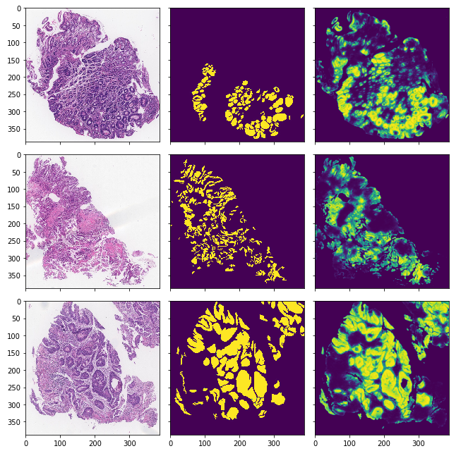

# Image segmentation on colorectal tissue for tumor detection

* implementation of the original [UNET architecture](https://arxiv.org/pdf/1505.04597.pdf) with some batch normalization at the end of the encoding layers

* uses PyTorch's `DataParaller` thus can be run on multiple GPUs, you just have to make the net parallel:

    * on a single GPU just leave parallelization out

```python
from patho import UNET
net = UNET()
net.make_parallel()
```

* the model can be initialized with any net and can be trained with binary cross entropy loss and binary cross entropy loss with jaccard index:

```python
from patho import UNET, Model
net = UNET()
model = Model(net, lr=5e-3, with_jaccard=True)
```

* if the model was trained before a saved model is present in the `data/` directory of the project `model.pt`

```python
from patho import UNET, Model
net = UNET()
model = Model(net, lr=5e-3, with_jaccard=True, load_model=True)
```

* for training one only needs to provide the data loader to the `.train(data_loader)` function of the model

```python
from patho import DataLoader
data_loader = DataLoader("patho/data/crc", "images",
                         "masks", batch_size=3).getInstance()

#
# ... code intentionally left out ...
#

model.train(data_loader)
```

* the trained model performs followingly after ~50 epochs
where the first column shows the original image, the second shows the binary masks that annotates cancerous tissue and the last column shows the binary mask generated by the model, brighter spots representing higher probabilities for cancer



* model trained for ~80 epochs can be downloaded from [here](https://drive.google.com/file/d/1128goU-HHwg2FGqewemmp4y7IHfg5s3N/view?usp=sharing) just insert it into the `patho/data/` directory and call the `Model` class with the `load_model` option
